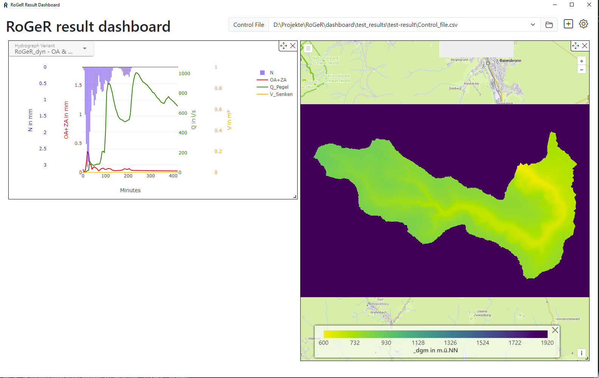
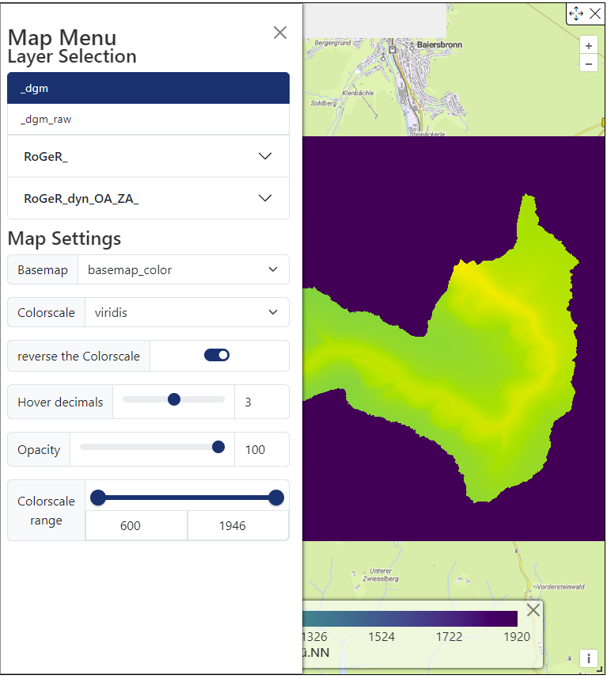
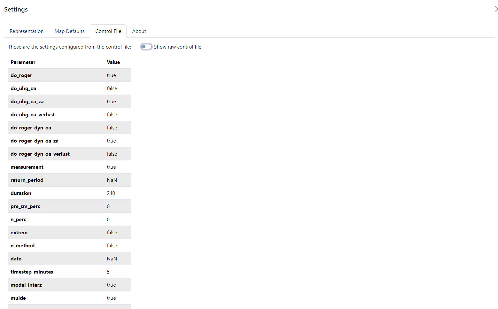

# RoGeR Dashboard

This is a small dashboard electron app to visualize RoGeR results.

To get a quick idea how the app looks like, check out the screenshot below.
<figure>
    
    <figcaption>Screenshot of the main user interface</figcaption>
</figure>

For further screenshots have a look at the [screenshots directory](./doc/screenshots).

## install

To install the app, download the latest release from the [releases page](https://github.com/Hydrology-IFH/roger_dashboard/releases) and download the appropriate installer for your system.

## first usage

When you start the app for the first time, you will have to select a RoGeR results directory. This is the directory where your RoGeR results are stored. The app will then load the results and display them in the user interface. It will also store the result direcory for future use, so you won't have to search for it again.

You will find different blocks in the user interface, each displaying different information about the RoGeR results. You can add as many blocks as you like and customize them to your needs. The blocks can be moved around and resized to fit your screen.

Until now, the app supports the following plot-blocks:
- **Map**: Displays the TIF-rasters from the RoGeR results on a map. Also supports the "Zeitschritte" Rasters with a timescale slider to select the time step.
- **Hydrograph**: Displays the hydrograph of a selected catchment if found in the result directory.

### Map plot

The map plot displays the TIF-rasters from the RoGeR results on a map.
To customize the map you have to open the settings block inside the map block.

<figure>
    
    <figcaption>Screenshot of the map plots menu</figcaption>
</figure>

On top is a layer selection menu, where you can select the rasters you want to display on the map.
Below that is a map settings menu, where you can change the map style, colorscale range, hover decimals and the opacity of the rasters.

To compare multiple rasters you can add multiple map blocks to the user interface. Each map block can have its own settings and display different rasters.

### Settings

On the top right corner of the user interface you will find a settings button. This opens a settings block where you can change the app settings.

Here you can change e.g. the default map settings or store your momentary block layout as the new default layout. This will be used the next time you start the app.
You can also reset the app to its default plot-layout.

Furthermore you can have a look at the detected RoGeR control file settings:
<figure>
    
    <figcaption>Screenshot of the Settings section about the RoGeR control file</figcaption>
</figure>

## development

To develop the app, clone the repository and install the dependencies with `npm install`. Then you can run the app with `npm run dev`.